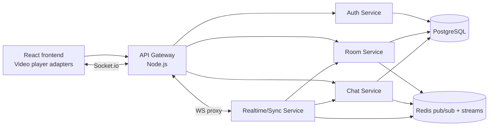

# OnlyTogether

Веб-приложение для совместного просмотра видео с YouTube, VK Video и RUTUBE с синхронизацией плеера и чатом.

## Краткая Архитектурная Схема



## Сервисы И Ответственность

- `api-gateway`: единая REST-точка входа, CORS, JWT middleware для защищённых маршрутов, проксирование Socket.io на realtime-сервис.
- `auth-service`: регистрация, логин, выдача JWT access token, `/me`, событие `auth:user_registered`.
- `room-service`: комнаты, invite-коды, участники, лимит участников, удаление комнат владельцем, каноническое состояние видео в `rooms.current_state`.
- `chat-service`: история сообщений, отправка сообщений, системные сообщения по событиям входа/выхода.
- `realtime-service`: Socket.io, presence в Redis, трансляция Redis-событий в комнаты, приём команд чата и плеера.
- `postgres`: основная БД.
- `redis`: pub/sub для realtime-событий, stream `onlytogether:events`, short-lived presence.

## Схема БД

Основные таблицы находятся в [database/init.sql](./database/init.sql).

```sql
users(id, email, username, password_hash, created_at, updated_at)
rooms(
  id, owner_id, title, max_participants,
  youtube_url, youtube_video_id,
  video_provider, video_url, video_id, video_embed_url,
  invite_code,
  current_state jsonb, state_updated_at, created_at, updated_at
)
room_members(id, room_id, user_id, role, joined_at, left_at, is_active)
messages(id, room_id, user_id, type, content, created_at)
room_events(id, room_id, user_id, event_type, payload jsonb, created_at)
```

`rooms.current_state` хранит:

```json
{
  "status": "playing | paused | stopped",
  "positionSec": 42.5,
  "videoId": "dQw4w9WgXcQ",
  "videoProvider": "youtube | vk | rutube",
  "action": "play",
  "updatedBy": { "id": "user-uuid", "username": "alice" },
  "updatedAt": "2026-04-29T12:00:00.000Z"
}
```

## API Контракт

Base URL для frontend: `http://localhost:8080`.

### `POST /auth/register`

Auth: public.

Request:

```json
{ "email": "alice@example.com", "username": "alice", "password": "password123" }
```

Response `201`:

```json
{ "user": { "id": "uuid", "email": "alice@example.com", "username": "alice" }, "accessToken": "jwt" }
```

Ошибки: `400 VALIDATION_ERROR`, `409 USER_ALREADY_EXISTS`.

### `POST /auth/login`

Auth: public.

Request:

```json
{ "email": "alice@example.com", "password": "password123" }
```

Response `200`:

```json
{ "user": { "id": "uuid", "email": "alice@example.com", "username": "alice" }, "accessToken": "jwt" }
```

Ошибки: `400 VALIDATION_ERROR`, `401 INVALID_CREDENTIALS`.

### `GET /me`

Auth: `Bearer <jwt>`.

Response:

```json
{ "user": { "id": "uuid", "email": "alice@example.com", "username": "alice" } }
```

Ошибки: `401 UNAUTHORIZED`, `401 INVALID_TOKEN`, `404 USER_NOT_FOUND`.

### `POST /rooms`

Auth: `Bearer <jwt>`.

Request:

```json
{
  "title": "Friday movie",
  "maxParticipants": 8,
  "videoUrl": "https://www.youtube.com/watch?v=dQw4w9WgXcQ"
}
```

Response `201`:

```json
{
  "room": {
    "id": "uuid",
    "title": "Friday movie",
    "ownerId": "uuid",
    "maxParticipants": 8,
    "activeCount": 1,
    "videoProvider": "youtube",
    "videoProviderLabel": "YouTube",
    "videoId": "dQw4w9WgXcQ",
    "videoUrl": "https://www.youtube.com/watch?v=dQw4w9WgXcQ",
    "videoEmbedUrl": "https://www.youtube.com/embed/dQw4w9WgXcQ?enablejsapi=1",
    "inviteCode": "code",
    "inviteUrl": "/invite/code",
    "currentUserRole": "owner",
    "currentState": {}
  }
}
```

Для обратной совместимости `youtubeUrl` также принимается как алиас `videoUrl`.

Ошибки: `400 VALIDATION_ERROR`, `400 INVALID_VIDEO_URL`, `400 UNSUPPORTED_VIDEO_URL`, `401 INVALID_TOKEN`.

### `GET /rooms`

Auth: `Bearer <jwt>`.

Возвращает только комнаты, где текущий пользователь является владельцем. Комнаты, к которым пользователь присоединился по invite-ссылке как участник, не показываются в Dashboard.

Response:

```json
{ "rooms": [{ "id": "uuid", "title": "Friday movie", "currentUserRole": "owner" }] }
```

Ошибки: `401 UNAUTHORIZED`, `401 INVALID_TOKEN`.

### `GET /rooms/:id`

Auth: `Bearer <jwt>`, пользователь должен быть активным участником.

Response:

```json
{ "room": { "id": "uuid", "members": [], "currentState": {} } }
```

Ошибки: `403 ROOM_MEMBERSHIP_REQUIRED`, `404 ROOM_NOT_FOUND`.

### `POST /rooms/:id/join`

Auth: `Bearer <jwt>`.

Request:

```json
{ "inviteCode": "optional-code" }
```

Response:

```json
{ "room": { "id": "uuid", "currentUserRole": "participant" } }
```

Ошибки: `403 INVALID_INVITE`, `409 ROOM_IS_FULL`, `404 ROOM_NOT_FOUND`.

### `DELETE /rooms/:id`

Auth: `Bearer <jwt>`, удалить комнату может только владелец.

Response: `204 No Content`.

Побочный эффект: каскадно удаляются участники, сообщения и события комнаты; публикуется `room:deleted`.

Ошибки: `403 FORBIDDEN_ROOM_DELETE`, `404 ROOM_NOT_FOUND`.

### `POST /rooms/:id/leave`

Auth: `Bearer <jwt>`.

Response: `204 No Content`.

Ошибки: `404 ACTIVE_MEMBERSHIP_NOT_FOUND`.

### `GET /rooms/:id/messages`

Auth: `Bearer <jwt>`, пользователь должен быть активным участником.

Response:

```json
{ "messages": [{ "id": "uuid", "type": "user", "content": "Hi", "user": { "id": "uuid", "username": "alice" } }] }
```

Ошибки: `403 ROOM_MEMBERSHIP_REQUIRED`.

### `POST /rooms/:id/messages`

Auth: `Bearer <jwt>`.

Request:

```json
{ "content": "Hello" }
```

Response `201`:

```json
{ "message": { "id": "uuid", "type": "user", "content": "Hello" } }
```

Ошибки: `400 VALIDATION_ERROR`, `403 ROOM_MEMBERSHIP_REQUIRED`.

Дополнительно для invite-flow:

- `GET /rooms/invite/:inviteCode`
- `POST /rooms/invite/:inviteCode/join`
- `GET /rooms` для Dashboard со списком owned rooms.

## Real-Time События

Socket.io клиент подключается к `VITE_SOCKET_URL` с `auth: { token }`.

### Клиент -> сервер

`room:join`

```json
{ "roomId": "uuid" }
```

`room:leave`

```json
{ "roomId": "uuid" }
```

`chat:send_message`

```json
{ "roomId": "uuid", "content": "Hello" }
```

`sync:video_play`

```json
{ "roomId": "uuid", "positionSec": 12.3 }
```

Команды `sync:video_*` доступны любому активному участнику комнаты.

`sync:video_pause`

```json
{ "roomId": "uuid", "positionSec": 12.3 }
```

`sync:video_seek`

```json
{ "roomId": "uuid", "positionSec": 90 }
```

`sync:video_stop`

```json
{ "roomId": "uuid", "positionSec": 0 }
```

### Сервер -> клиент

`chat:message_sent`

```json
{ "roomId": "uuid", "message": { "id": "uuid", "type": "user", "content": "Hello" } }
```

`sync:state_updated`

```json
{
  "roomId": "uuid",
  "action": "play",
  "state": {
    "status": "playing",
    "positionSec": 12.3,
    "videoId": "dQw4w9WgXcQ",
    "updatedBy": { "id": "uuid", "username": "alice" },
    "updatedAt": "2026-04-29T12:00:00.000Z"
  }
}
```

`presence:updated`

```json
{ "roomId": "uuid", "userIds": ["uuid"], "count": 1 }
```

`room:user_joined`

```json
{ "roomId": "uuid", "user": { "id": "uuid", "username": "alice" } }
```

`room:user_left`

```json
{ "roomId": "uuid", "user": { "id": "uuid", "username": "alice" } }
```

`room:deleted`

```json
{ "roomId": "uuid", "title": "Friday movie", "deletedBy": { "id": "uuid", "username": "alice" } }
```

### Межсервисные события Redis

- `auth:user_registered`: `{ userId, email, username }`
- `room:created`: `{ roomId, ownerId, title, videoProvider, videoId, inviteCode }`
- `room:user_joined`: `{ roomId, user: { id, username }, inviteCode }`
- `room:user_left`: `{ roomId, user: { id, username } }`
- `room:deleted`: `{ roomId, title, deletedBy: { id, username } }`
- `chat:message_sent`: `{ roomId, message }`
- `sync:video_play`: `{ roomId, action, state, updatedBy }`
- `sync:video_pause`: `{ roomId, action, state, updatedBy }`
- `sync:video_seek`: `{ roomId, action, state, updatedBy }`
- `sync:video_stop`: `{ roomId, action, state, updatedBy }`
- `sync:state_updated`: `{ roomId, action, state, updatedBy }`

## Локальный Запуск

1. Скопировать переменные окружения при необходимости:

```bash
cp .env.example .env
```

2. Запустить OnlyTogether:

```bash
docker compose up --build
```

3. Открыть:

- frontend: `http://localhost:5173`
- API gateway health: `http://localhost:8080/health`

### YouTube И HTTPS Dev-Домен

YouTube iframe может показывать антибот-плашку на `localhost`, в свежих профилях браузера, при VPN/прокси или строгой блокировке third-party cookies. Приложение использует официальный YouTube IFrame API, передает `enablejsapi=1` и указывает `origin`.

Для проверки YouTube лучше поднимать frontend и gateway на HTTPS dev-домене или через туннель. Минимальные переменные:

```env
FRONTEND_URL=https://your-app.ngrok.app
VITE_PUBLIC_ORIGIN=https://your-app.ngrok.app
VITE_API_URL=https://your-api.ngrok.app
VITE_SOCKET_URL=https://your-api.ngrok.app
```

`VITE_PUBLIC_ORIGIN` должен совпадать с origin страницы, где открыт iframe. Если переменная не задана, frontend использует `window.location.origin`.

## Логирование И Трассировка

Все backend-сервисы пишут структурные JSON-логи только в stdout/stderr. Обычные события пишутся в stdout с `level: "info"`, ошибки пишутся в stderr с `level: "error"`. В каждой записи есть `time`, `service`, `message` и полезные поля события.

Для каждого входящего HTTP-запроса генерируется или принимается заголовок `X-Request-ID`. Он возвращается клиенту в ответе, добавляется в HTTP-логи и пробрасывается из `api-gateway` во внутренние микросервисы. Это позволяет найти все записи одного запроса:

```bash
curl -i -H "X-Request-ID: demo-request-1" http://localhost:8080/health
docker compose logs -f api-gateway auth-service room-service chat-service realtime-service
```

## Graceful Shutdown

Backend-сервисы обрабатывают `SIGTERM` и `SIGINT`: сначала переходят в режим отказа от новых запросов с `503 Service Unavailable`, затем ждут завершения уже принятых HTTP-запросов, закрывают HTTP-сокеты, Postgres pool, Redis clients/subscribers и только после этого завершают процесс. Тайм-аут задается через `SHUTDOWN_TIMEOUT_MS`, окно для проверки отказа новых запросов - через `SHUTDOWN_REJECT_WINDOW_MS`.

Проверка локально:

```bash
docker compose up --build -d
docker kill --signal=SIGTERM $(docker compose ps -q api-gateway)
docker compose logs -f api-gateway
```

В Docker Compose ручной `docker kill` считается ручной остановкой контейнера, поэтому для локальной проверки восстановления можно поднять сервис обратно командой:

```bash
docker compose up -d api-gateway
```

В оркестраторе перезапуск выполняется самим runtime. Для локальной среды в `docker-compose.yml` добавлены `restart: unless-stopped` и `stop_grace_period: 15s`.

## Структура Проекта

```text
frontend/                  React + Vite + Socket.io client + video player adapters
services/api-gateway/      REST gateway + JWT middleware + WS proxy
services/auth-service/     Auth/JWT/users
services/room-service/     Rooms/members/video state
services/chat-service/     Messages/history/system messages
services/realtime-service/ Socket.io sync/presence
services/shared/           Shared db/jwt/events/errors/validation utilities
database/init.sql          PostgreSQL schema
docker-compose.yml         Local infrastructure and services
```
